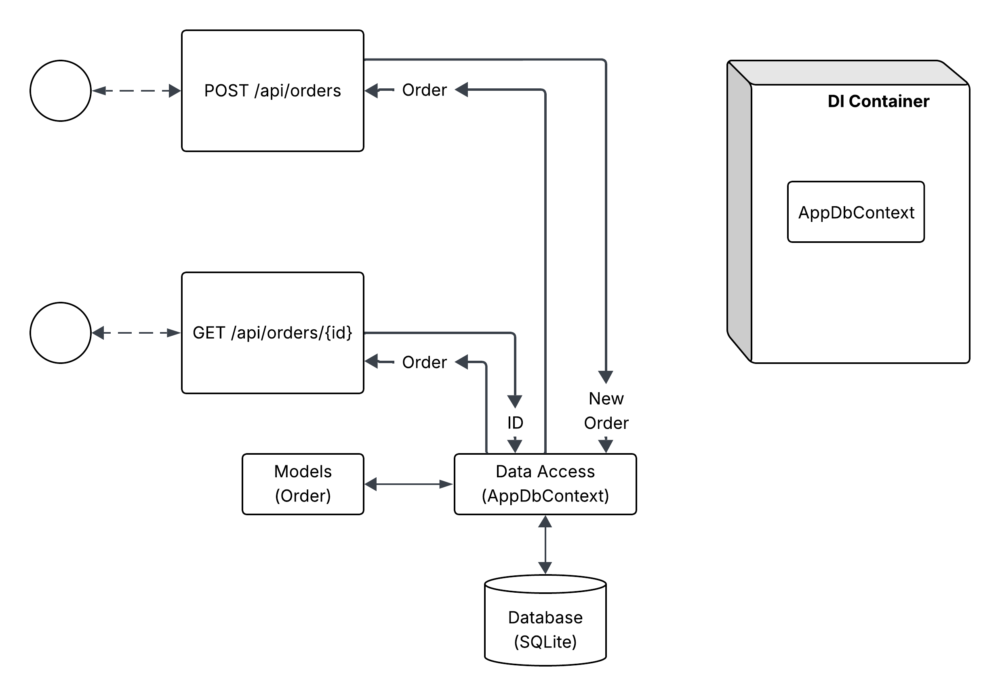
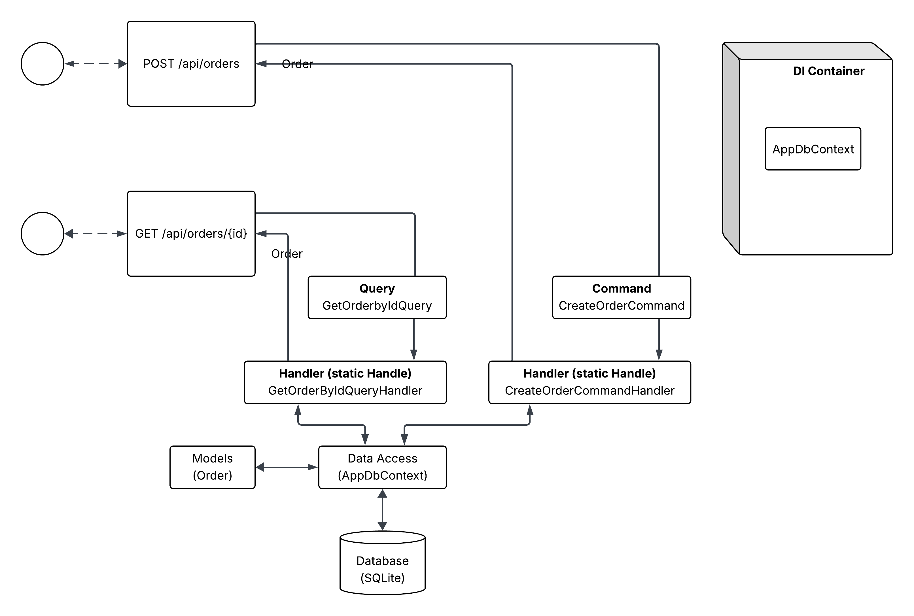
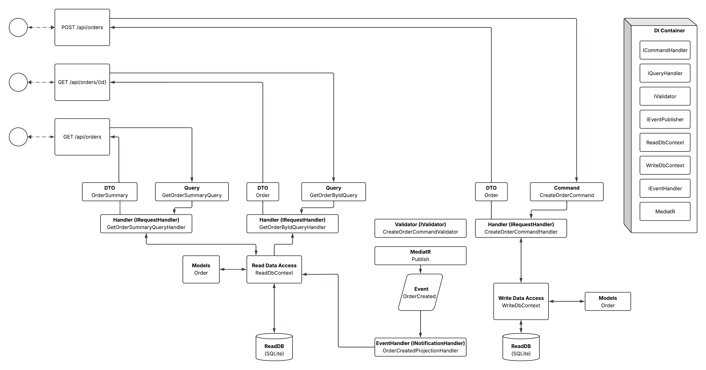

# Evolving a minimal RESTful API to an event-driven application, using CQRS patter, with Validation and MediatR

## 1. What is CQRS and Why is it Used?:

- Command Query Responsibility Segregation (CQRS) is an architectural pattern that separates the models for reading data from the models for updating data. In traditional architectures, a single data model is used to perform both tasks. While this works for simple CRUD applications, it creates bottlenecks as systems scale. Commands (Write operations) represent the intent to change the state of the system, while Queries (Read operations) simply retrieve data without modifying it.
- By segregating these responsibilities, developers can optimize each side independently. For instance, the write side can focus on complex business logic, data integrity, and complex transactions, while the read side can focus on performance, indexing, and returning flat data structures (DTOs) that the UI needs. This separation allows for better scalability, as read and write workloads often have different performance characteristics, and it simplifies the code by adhering to the Single Responsibility Principle at the architectural level.

---

## 2. PHASE 1: The Minimal API Starting Point

- The project began as a standard .NET Minimal API. In this phase, the architecture is monolithic and highly coupled. The Program.cs file acts as the primary orchestrator, containing the route definitions, business logic, and direct calls to the Data Access layer. As seen in the first diagram, the application utilizes a single AppDbContext to interact with a SQLite database. The domain Model (Order) is used directly for both input and output, creating a tight coupling between the database schema and the API contract.
- While this approach is excellent for rapid prototyping and small-scale services, it lacks maintainability. The DI Container is sparsely populated, only managing the AppDbContext. As more features are added, the Program.cs becomes a "God Object," making the code difficult to test, navigate, and scale without breaking existing functionality.

---

## 3. PHASE 2: Initial CQRS Segregation

- Here, the logic is moved out of the API endpoints and into specialized objects: Commands and Queries. This introduces the concept of Handlers. Instead of the API route knowing "how" to create an order, it simply issues a CreateOrderCommand. A dedicated CreateOrderCommandHandler then executes the logic. Similarly, data retrieval is encapsulated in a GetOrderByIdQuery and its corresponding handler.
- This phase introduces a cleaner separation of concerns. The API becomes a thin transport layer, while the handlers contain the "meat" of the application logic. However, at this stage, the system still shares a single Data Access layer (AppDbContext) and a single SQLite database for both reads and writes. While the code is more organized, the underlying data storage hasn't yet been optimized for the different performance needs of commands versus queries.

---

## 4. FINAL PHASE: Event-Driven Architecture and full CQRS Implementation

- Several critical components were introduced to reach this state:

1) MediatR and Validation: The application now uses MediatR as an in-process bus to decouple the request from the handler. A Fluent Validation layer (IValidator) is integrated into the pipeline, ensuring that the CreateOrderCommand is checked for correctness before it ever reaches the handler.
2) Data Segregation and DTOs: The architecture now distinguishes between a WriteDbContext and a ReadDbContext. The use of DTOs (OrderSummary, Order) ensures that the internal domain models are never exposed directly to the client, providing a layer of abstraction that allows the database and the API to evolve independently.
3) Event-Driven Projections: This is the most significant change. When a CreateOrderCommandHandler completes its task, it doesn't just finish; it publishes an OrderCreated event via MediatR. An OrderCreatedProjectionHandler listens for this event and updates the ReadDB. This allows the Read side to have its own optimized data structure (like the new Order Summary functionality) which is updated asynchronously or as a side-effect of the write operation.
4) Expanded DI Container: The DI Container now manages a complex web of interfaces, including ICommandHandler, IQueryHandler, IValidator, and IEventPublisher, reflecting a highly modular and testable system. Some of the interfaces were later removed with the introduction of MediatR, which provides useful methods, as well as its own interfaces such as the IRequestHandler and the INotificationHandler, among other things.

---

### Conclusion

- The evolution of this project demonstrates the journey from a simple, functional script-like API to a robust, scalable architectural pattern. Moving from a Minimal API to a full CQRS implementation with MediatR allows the developer to handle complexity by breaking it into small, isolated, and testable pieces.
- By introducing an Event-Driven approach in the final phase, the system achieves a level of "eventual consistency" that is common in high-performance distributed systems. This architecture ensures that the Write side remains fast and focused on business rules, while the Read side is optimized for high-speed data retrieval. Although it introduces more boilerplate and moving parts, the trade-off is a system that is significantly easier to maintain, extend, and scale as business requirements grow.
